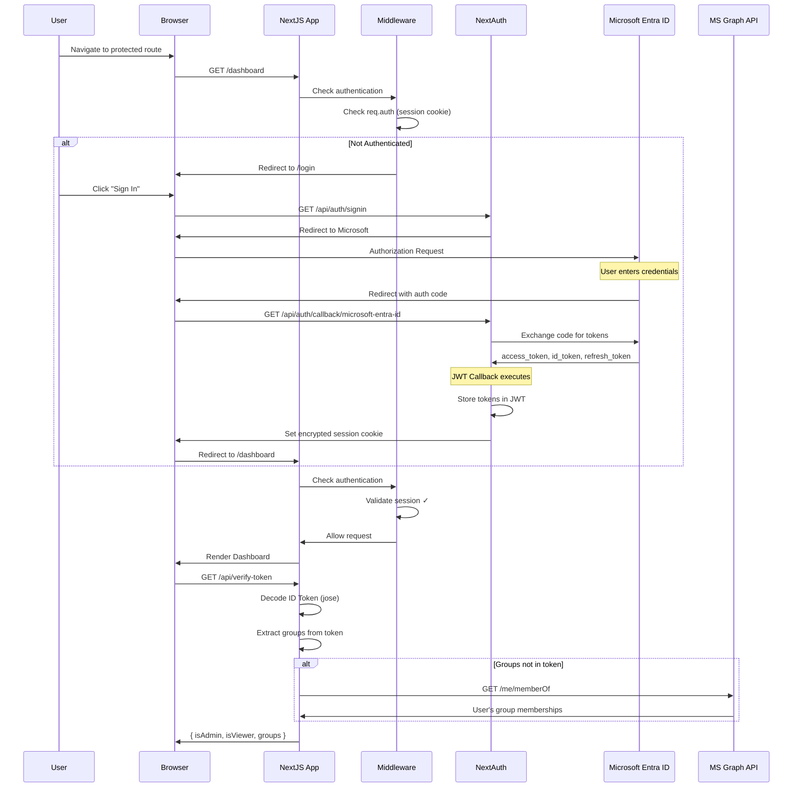
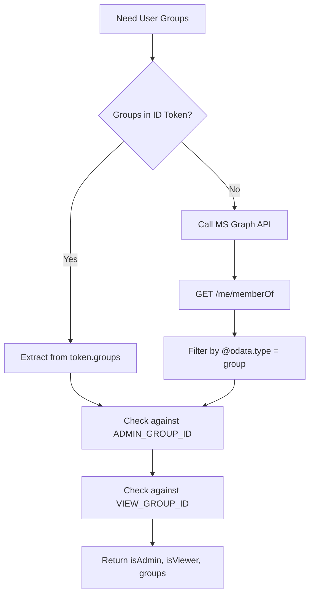
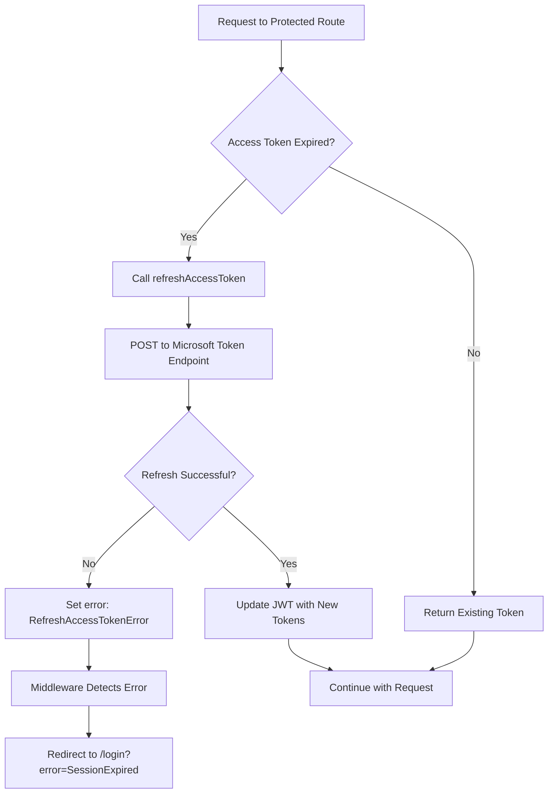

# Login Flow & Session Management

This document explains the authentication flow, group ID retrieval, and session storage in the NextJS SSO application with Microsoft Entra ID.

---

## Table of Contents

1. [Authentication Flow Overview](#authentication-flow-overview)
2. [Flow Diagram](#flow-diagram)
3. [Session Storage](#session-storage)
4. [Group ID Retrieval](#group-id-retrieval)
5. [Token Refresh Flow](#token-refresh-flow)

---

## Authentication Flow Overview

The application uses **NextAuth.js v5** with **Microsoft Entra ID (Azure AD)** as the OAuth 2.0 / OpenID Connect provider.

### Key Components

| Component | File | Purpose |
|-----------|------|---------|
| Auth Configuration | `src/lib/auth.ts` | NextAuth setup with Microsoft Entra ID provider |
| Middleware | `src/middleware.ts` | Route protection and session validation |
| Token Utilities | `src/lib/token-utils.ts` | JWT decoding, verification, group checking |
| Verify Token API | `src/app/api/verify-token/route.ts` | Server-side token verification and role extraction |
| User Roles Hook | `src/hooks/useUserRoles.ts` | Client-side hook for fetching user roles |

---

## Flow Diagram



### Login Flow Steps

1. **User Access**: User navigates to a protected route (e.g., `/dashboard`)
2. **Middleware Check**: `middleware.ts` intercepts the request and checks `req.auth`
3. **Redirect to Login**: If not authenticated, redirects to `/login?callbackUrl=/dashboard`
4. **OAuth Initiation**: User clicks sign in, NextAuth redirects to Microsoft Entra ID
5. **User Authentication**: User enters credentials on Microsoft login page
6. **Callback Processing**: Microsoft redirects back with authorization code
7. **Token Exchange**: NextAuth exchanges the code for tokens (access, ID, refresh)
8. **JWT Creation**: The `jwt` callback stores tokens in an encrypted JWT
9. **Session Cookie**: NextAuth sets an encrypted HTTP-only cookie
10. **Redirect**: User is redirected to the original requested page

---

## Session Storage

### Where is the session stored?

```
┌─────────────────────────────────────────────────────────────┐
│                    CLIENT (Browser)                         │
│  ┌───────────────────────────────────────────────────────┐  │
│  │  HTTP-Only Cookie: authjs.session-token               │  │
│  │  ──────────────────────────────────────────────────   │  │
│  │  Contains: Encrypted JWT with session data            │  │
│  │  Encryption Key: NEXTAUTH_SECRET                      │  │
│  │  Max Age: SESSION_MAX_AGE (default: 3600s)            │  │
│  └───────────────────────────────────────────────────────┘  │
└─────────────────────────────────────────────────────────────┘
```

### Session Strategy: JWT (Stateless)

The application uses **JWT-based sessions** (no database required):

```typescript
// src/lib/auth.ts
session: {
  strategy: "jwt",
  maxAge: parseInt(process.env.SESSION_MAX_AGE || "3600"),
}
```

### What's stored in the JWT?

| Field | Description |
|-------|-------------|
| `accessToken` | Microsoft Graph API access token |
| `idToken` | OpenID Connect ID token (contains user info + groups) |
| `refreshToken` | Token to obtain new access tokens |
| `accessTokenExpires` | Timestamp when access token expires |
| `sub` | User's unique identifier (OID) |
| `name` | User's display name |
| `email` | User's email address |
| `error` | Error state (e.g., "RefreshAccessTokenError") |

### Cookie Details

| Property | Value |
|----------|-------|
| **Cookie Name** | `authjs.session-token` |
| **HttpOnly** | Yes (not accessible via JavaScript) |
| **Secure** | Yes (in production, requires HTTPS) |
| **SameSite** | Lax |
| **Encryption** | AES-256-GCM using `NEXTAUTH_SECRET` |

### Security Note

The `NEXTAUTH_SECRET` environment variable is used to:
- Encrypt/decrypt the session cookie
- Sign the JWT to prevent tampering
- Generate CSRF tokens

```bash
# Generate a secure secret
openssl rand -base64 32
```

---

## Group ID Retrieval

### Two Methods for Getting Groups



### Method 1: From ID Token Claims (Preferred)

Groups can be included directly in the ID token if configured in Azure:

```typescript
// src/lib/token-utils.ts
export function checkUserGroups(tokenPayload: TokenPayload): GroupCheckResponse {
  const groups = tokenPayload.groups || [];  // Array of group IDs
  const adminGroupId = process.env.ADMIN_GROUP_ID || "";
  const viewGroupId = process.env.VIEW_GROUP_ID || "";

  const isAdmin = groups.includes(adminGroupId);
  const isViewer = groups.includes(viewGroupId) || isAdmin;

  return { isAdmin, isViewer, groups, userInfo: {...} };
}
```

**Azure Configuration Required:**
1. Azure Portal → App Registration → Token configuration
2. Add "groups" claim
3. Select "Security groups" or "Groups assigned to the application"

### Method 2: From Microsoft Graph API (Fallback)

If groups aren't in the token (e.g., user has many groups):

```typescript
// src/lib/token-utils.ts
export async function fetchUserGroups(accessToken: string): Promise<string[]> {
  const response = await fetch(
    "https://graph.microsoft.com/v1.0/me/memberOf",
    {
      headers: {
        Authorization: `Bearer ${accessToken}`,
      },
    }
  );

  const data = await response.json();
  return data.value
    .filter(item => item["@odata.type"] === "#microsoft.graph.group")
    .map(group => group.id);
}
```

**Required Permission:** `GroupMember.Read.All`

### Role Checking Flow

```typescript
// src/app/api/verify-token/route.ts
// 1. Try getting groups from token
let groupResponse = checkUserGroups(tokenPayload);

// 2. If no groups in token, fetch from Graph API
if (groupResponse.groups.length === 0 && session.accessToken) {
  const fetchedGroups = await fetchUserGroups(session.accessToken);
  // ... update groupResponse
}
```

### Environment Variables

```env
# Group IDs from Azure Portal > Entra ID > Groups
ADMIN_GROUP_ID=xxxxxxxx-xxxx-xxxx-xxxx-xxxxxxxxxxxx
VIEW_GROUP_ID=yyyyyyyy-yyyy-yyyy-yyyy-yyyyyyyyyyyy
```

---

## Token Refresh Flow



### Refresh Token Implementation

```typescript
// src/lib/auth.ts
async function refreshAccessToken(token: JWT): Promise<JWT> {
  const url = `https://login.microsoftonline.com/${TENANT_ID}/oauth2/v2.0/token`;

  const response = await fetch(url, {
    method: "POST",
    body: new URLSearchParams({
      client_id: process.env.AZURE_AD_CLIENT_ID!,
      client_secret: process.env.AZURE_AD_CLIENT_SECRET!,
      grant_type: "refresh_token",
      refresh_token: token.refreshToken!,
      scope: "openid profile email User.Read GroupMember.Read.All",
    }),
  });

  // ... handle response
}
```

### Token Lifecycle

| Token | Lifetime | Storage |
|-------|----------|---------|
| Access Token | ~1 hour | In JWT (cookie) |
| ID Token | ~1 hour | In JWT (cookie) |
| Refresh Token | 90 days (rolling) | In JWT (cookie) |
| Session Cookie | `SESSION_MAX_AGE` | Browser |

---

## Summary

| Aspect | Implementation |
|--------|----------------|
| **Auth Provider** | Microsoft Entra ID (Azure AD) |
| **Auth Library** | NextAuth.js v5 |
| **Session Strategy** | JWT (stateless, no database) |
| **Session Storage** | Encrypted HTTP-only cookie |
| **Encryption** | AES-256-GCM via `NEXTAUTH_SECRET` |
| **Group Retrieval** | ID token claims OR Graph API fallback |
| **Token Refresh** | Automatic via refresh_token |
| **Route Protection** | Next.js middleware |
